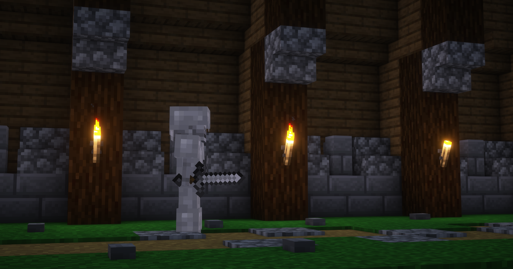

# Our Second Mob

In the past few pages, we have been working on our Demonic Mage mob.
We gave it health, damage, equipment, options, a few abilities, and added custom drops to it.
Now, we will be working on a second mob, the Royal Guard, and through the creation process, learn many more fundamental concepts of Mythic.



> _The Demonic Mage ravaged the kingdom, and the Royal Guard was sent to stop it. The Royal Guard is a skilled fighter, and will not go down without a fight._

This mob is more complex than the Demonic Mage. It:

- Switches between a sword and a bow depending on the distance between it and its target
- Attacks hostile enemies
- Randomly does a combo attack when attacking with a sword
- Shoots 3 arrows at once when attacking with a bow

## Creating the Mob

Just like the Demonic Mage, we will create a mob file for the Royal Guard.

<FileTree
    paths={[
        "config.yml",
        "defaultOpen:Mobs/ExampleMobs.yml",
        "Mobs/DemonicMage.yml",
        "Mobs/hl-add:RoyalGuard.yml",
        "Skills/ExampleSkills.yml",
        "Skills/DemonicMageSkills.yml",
        "DropTables/ExampleDropTables.yml",
    ]}
    title={<h3>MythicMobs folder</h3>}
/>

We will configure it with what we already know:

```yml
RoyalGuard:
  Type: SKELETON
  Display: '&6⚔ &7Royal Guard &6⚔'
  Health: 100
  Damage: 10
  Options:
    MovementSpeed: 0.3
    PreventOtherDrops: true
    PreventSunburn: true
    KnockbackResistance: 1
  Equipment:
  - IRON_SWORD HAND
  - IRON_HELMET HEAD
  - IRON_CHESTPLATE CHEST
  - IRON_LEGGINGS LEGS
  - IRON_BOOTS FEET
  KillMessages:
  - <target.name> was killed by a Royal Guard
```

If you don't know what some of these options do, you should revisit the previous pages.
