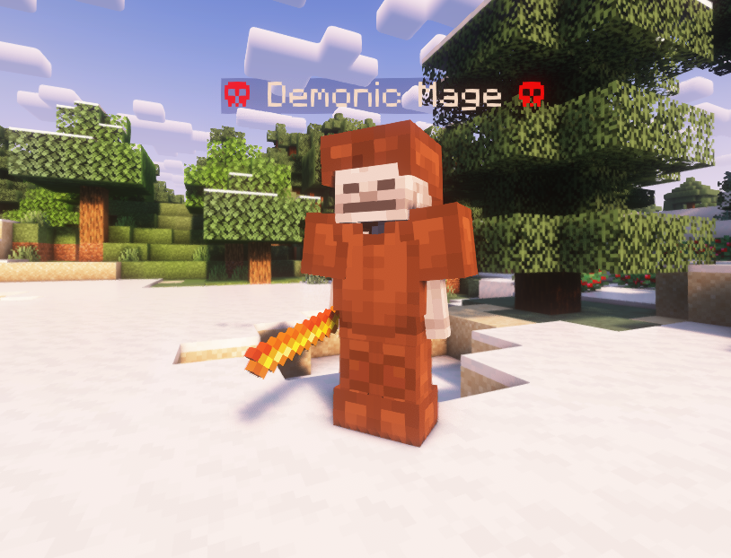

# Your First Mob

:::caution Placeholder page

This page is a placeholder. It will be replaced with a proper tutorial soon.

:::

:::info Design Philosophy

The guide follows the philosophy of "learning by doing".
By learning through a real project, you will learn important concepts and will be able to practically apply them.
Therefore, we are going to straight away start with creating a mob.

:::

## What we are going to create



The mob we are going to create is called the Demonic Mage.
It is a mob with 100 health and has two attacks - a melee attack and a ranged attack.
The melee attack does 5 hearts of damage, and the ranged attack shoots a fireball.
When it dies, it will explode and deal damage to nearby enemies.
It drops blaze powders and fire charges when killed.

If you're ready, let's get started! Make sure you have a server with MythicMobs installed along with VSCode.

## Exploring the MythicMobs folder

If you have MythicMobs installed, you should have a folder called `MythicMobs` under your server's `plugins` folder.
This folder contains all the files that MythicMobs uses to run and should contain a few folders and files, including:

<FileTree
    paths={[
        "config.yml",
        "Mobs/ExampleMobs.yml",
        "...",
    ]}
    title={<h3>MythicMobs folder</h3>}
/>

The `config.yml` file contains all the settings for MythicMobs, and the `Mobs` folder contains all the mobs that MythicMobs will load.
We are going to create a new file called `DemonicMage.yml` in the `Mobs` folder, and we will be creating our mob in this file.

So our file tree should now look like this:

<FileTree
    paths={[
        "config.yml",
        "defaultOpen:Mobs/ExampleMobs.yml",
        "Mobs/hl-add:DemonicMage.yml",
        "...",
    ]}
    title={<h3>MythicMobs folder</h3>}
/>

Notice how the files end in `.yml` - this tells us that these files are in the YAML format.

## Creating the mob

We are going to create a mob now!
Open up the `DemonicMage.yml` file we just made in VSCode, and paste the following code into it:

```yaml
DemonicMage:
  Type: SKELETON
  Display: "&4☠ &7Demonic Mage &4☠"
  Health: 100
  Damage: 10
```

Let's go through this line by line.

```yaml
DemonicMage:
```

This is the internal ID of the mob. It is used to refer to the mob in other places, such as in commands and skills.

```yaml
  Type: SKELETON
```

Since MythicMobs is a plugin, it cannot actually create custom entity types, so we have to base our mob on an existing entity type.
This line tells MythicMobs to base our mob off the `SKELETON` entity type.
Notice how it is **indented** - This is important, as it tells MythicMobs that this line is a part of the mob.

```yaml
  Display: "&4☠ &7Demonic Mage &4☠"
```

This line tells MythicMobs what the name of the mob should be.
The `&4` and `&7` are **color codes**, which tell MythicMobs to color the text red and grey respectively.
The `☠` is a Unicode character, which renders a skull.

```yaml
  Health: 100
```

This line tells MythicMobs how much health the mob should have.

```yaml
  Damage: 10
```

This line tells MythicMobs how much damage the mob should deal when it attacks.

## Does it work?

Let's see if our mob works!

Go to your server and type `/mm reload` to reload all the mobs.
Then, type `/mm mobs spawn DemonicMage` to spawn the mob. If everything went well, you should see a skeleton named <code><span style={{color: "#FF5555"}}>☠</span> <span style={{color: "#AAAAAA"}}>Demonic Mage</span> <span style={{color: "#FF5555"}}>☠</span></code> with 100 health and 10 damage.

## Equipment

Let's give our mob some equipment.
We will give it a set of leather armor and a blaze rod that represents its staff.

The `Equipment` section of a mob tells MythicMobs what equipment the mob should have.
To specify the equipment, we use the following format:

```yaml
Equipment:
- <item type> <slot>
```

For example, to give our mob a leather helmet, we would use:

```yaml
Equipment:
- LEATHER_HELMET HEAD
```

With that in mind, let's give our mob some equipment.

```yaml
DemonicMage:
  Type: SKELETON
  Display: "&4☠ &7Demonic Mage &4☠"
  Health: 100
  Damage: 10
  Equipment:
  - BLAZE_ROD HAND
  - LEATHER_HELMET HEAD
  - LEATHER_CHESTPLATE CHEST
  - LEATHER_LEGGINGS LEGS
  - LEATHER_BOOTS FEET
```

Now, `/mm reload` and `/mm mobs spawn DemonicMage` again.
You should see a skeleton with a blaze rod in its hand and leather armor.

## Additional mob options

There are many more options that you can use to customize your mob.
These options go under an `Options` section and are used to customize the mob's behavior.

For example, we can make our mob not burn in sunlight by adding the following line:

```yaml
Options:
  PreventSunburn: true
```

We can make our mob move faster by adding the following line:

```yaml
Options:
  PreventSunburn: true
  # highlight-start
  MovementSpeed: 0.5
  # highlight-end
```

Additionally, let's make the mob not drop the normal skeleton drops when it dies:

```yaml
Options:
  PreventSunburn: true
  MovementSpeed: 0.5
  # highlight-start
  PreventOtherDrops: true
  # highlight-end
```

Finally, let's make the mob immune to all knockback. We can do this by setting its knockback resistance to 1 (100%):

```yaml
Options:
  PreventSunburn: true
  MovementSpeed: 0.5
  PreventOtherDrops: true
  # highlight-start
  KnockbackResistance: 1
  # highlight-end
```

Let's put it all together:

```yaml
DemonicMage:
  Type: SKELETON
  Display: "&4☠ &7Demonic Mage &4☠"
  Health: 100
  Damage: 10
  Options:
    MovementSpeed: 0.3
    PreventOtherDrops: true
    PreventSunburn: true
    KnockbackResistance: 1
  Equipment:
  - BLAZE_ROD HAND
  - LEATHER_HELMET HEAD
  - LEATHER_CHESTPLATE CHEST
  - LEATHER_LEGGINGS LEGS
  - LEATHER_BOOTS FEET
```

## Conclusion

Congratulations! You have created your first mob!
You can now go on to create more mobs and customize them to your liking.

### Full Code

```yaml title="/plugins/MythicMobs/Mobs/DemonicMage.yml"
DemonicMage:
  Type: SKELETON
  Display: "&4☠ &7Demonic Mage &4☠"
  Health: 100
  Damage: 10
  Options:
    MovementSpeed: 0.3
    PreventOtherDrops: true
    PreventSunburn: true
    KnockbackResistance: 1
  Equipment:
  - BLAZE_ROD HAND
  - LEATHER_HELMET HEAD
  - LEATHER_CHESTPLATE CHEST
  - LEATHER_LEGGINGS LEGS
  - LEATHER_BOOTS FEET
```
